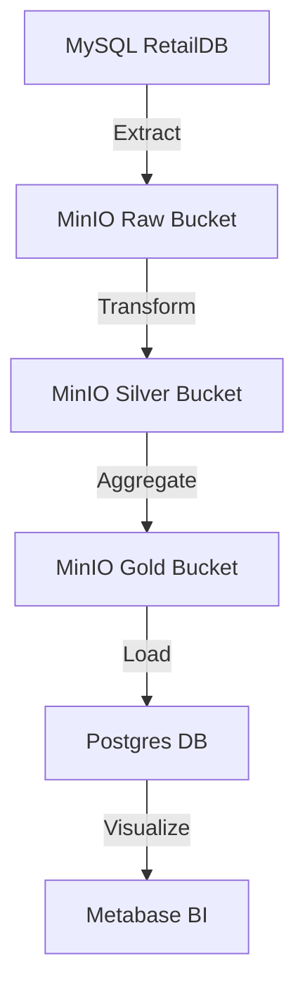

#  Data Engineering Project – Batch & Streaming Pipelines

This project demonstrates end-to-end Data Engineering pipelines using both Batch and Streaming approaches. It covers:

* Batch processing with RetailDB (using Pandas and Apache Spark)

* Real-time streaming processing of Weather data (using Kafka, Spark Structured Streaming, MinIO, and Postgres)

## Use-Case Sneraios

### Batch Data engineering 

In this project, we are implementing both batch processing and real-time streaming processing to handle different data needs. For the batch pipeline, we use the retaildb dataset from MySQL as the source. A scheduled ETL job extracts the raw data, cleans and transforms it into a standardized structure, and then stores the processed data in MinIO buckets. First, the data is stored as Silver tables, which contain cleaned and conformed data but still relatively detailed. From these Silver tables, additional business rules and aggregations are applied to produce Gold tables, which are curated, aggregated, and business-ready datasets. These Gold tables are stored in both MinIO (in the gold bucket) and Postgres for BI tools like Metabase to directly consume. For example, a Silver table may contain all detailed transactions from the orders table with cleaned product and customer details, while the corresponding Gold table could summarize total sales per region or per product category, ready for dashboards and reporting.  

- Source data comes from the **RetailDB** MySQL database.  
- A scheduled ETL job extracts the data, cleans and transforms it, and loads it into **MinIO buckets**.  
- The workflow produces two layers of data:  
  - **Silver tables** → contain cleaned and standardized data, still detailed.  
  - **Gold tables** → contain aggregated, business-ready datasets.  
- Both Silver and Gold tables are stored in MinIO (e.g., `silver` and `gold` buckets) and in **Postgres** for BI consumption.  
- Example:  
  - A Silver table might include all transactions from the `orders` table with cleaned product and customer details.  
  - A Gold table could summarize **total sales per region or per product category**, optimized for dashboards.  
- These Gold datasets are then used by BI tools like **Metabase** to provide insights for business stakeholders.  


### Real-time stream data processing

On the real-time streaming side, data is ingested from the OpenWeather API into a Kafka topic called weather. A streaming job processes micro-batches of 5 minutes, writing the raw data to a MinIO bucket. Another stream processing job continuously aggregates these records into 5-minute rolling averages of temperature and humidity per city, creating a real-time view of current weather metrics. Additionally, a batch job runs daily to calculate the average daily temperature and humidity per city, which is stored in Postgres as the weather_bt table. These batch and streaming outputs together allow the system to provide both historical analytics and real-time dashboards in Metabase, enabling business users to explore long-term trends as well as up-to-the-minute conditions.  

- Weather data is continuously ingested from the **OpenWeather API** into a Kafka topic called `weather`.  
- A **stream processing job** consumes this data in **5-minute micro-batches**, storing it in a MinIO bucket.  
- Another streaming job calculates **rolling averages** (temperature and humidity) per city for the last 5 minutes, creating a **real-time view** of current conditions.  
- In parallel, a **daily batch job** aggregates the data into average daily metrics and stores them in Postgres as the `weather_bt` table.  
- Both real-time and daily aggregated datasets are used to power **live dashboards in Metabase**, showing both up-to-the-minute conditions and long-term trends.  

### Why Silver and Gold Tables?  
- **Silver Tables**: Cleaned and standardized datasets that serve as the *single source of truth*. Example: detailed customer orders with corrected product IDs and normalized columns.  
- **Gold Tables**: Business-level, aggregated, and curated datasets designed for analytics and reporting. Example: daily sales revenue per region or average daily temperature per city.  

 
## Tech Stack 
| Component           | Purpose                                                                 |
| ------------------- | ----------------------------------------------------------------------- |
| **Apache Airflow**  | Orchestrates batch & streaming pipelines (DAG scheduling, dependencies) |
| **Apache Spark**    | Distributed data processing for batch and streaming pipelines           |
| **Pandas**          | Lightweight batch ETL on RetailDB for prototyping                       |
| **Kafka**           | Ingests weather data as a real-time event stream                        |
| **MinIO (S3a)**     | Acts as a Data Lake for raw and processed data (Bronze → Silver)        |
| **Postgres**        | Stores batch and real-time views (for analytics & dashboards)           |
| **RetailDB**        | Benchmark dataset for batch pipelines (orders, customers, products)     |
| **OpenWeather API** | Source for real-time weather data                                       |
| **Docker Compose**  | Containerized setup for Spark, Kafka, MinIO, Airflow, Postgres          |
| **Metabase**        | Business Intelligence Tool                                              |
|**Jupyter Notebook**  | Environment for EDA and Machine learning workloads                      |

## Stack Set-up installation

<pre>git clone https://github.com/sreepathysois/End-to-End-Data-Engineering-pipeline.git
cd End-to-End-Data-Engineering-pipeline
sudo docker-compose up --build -d </pre>

This setup all services: 

# Services Setup

| Service        | URL / Port              | Notes                           |
|----------------|-------------------------|---------------------------------|
| **Spark Master** | http://localhost:8085   | Accessible Spark Web UI          |
| **Spark Workers** | —                     | Connect to Spark Master          |
| **Kafka + Zookeeper** | —                 | Core messaging services           |
| **Kafka UI**   | http://localhost:8083   | Web UI for Kafka (if enabled)    |
| **MinIO**      | http://localhost:9090   | S3-compatible storage            |
| **Airflow**    | http://localhost:8082   | Workflow orchestration           |
| **Postgres**   | `localhost:5432`        | Default DB port                  |
| **Metabase**   | http://localhost:3000   | Data Visualization Tool( BI)     |
| **Jupyter Notebook**| http://localhost:8888| Environment for EDA            |  


## Post installation steps   

#### Verify Containers

Check that all containers are running (Airflow webserver, scheduler, workers, Spark master, Spark workers, Kafka, Zookeeper, MinIO, Postgres):

<pre>docker ps </pre>  

|CONTAINER ID | IMAGE | COMMAND | CREATED | STATUS | PORTS | NAMES|
|-------------|-------|---------|---------|--------|--------|-----|
|4dfe3f8cf88c | provectuslabs/kafka-ui:latest | "/bin/sh -c 'java --…" | 2 days ago | Up 2 days | 0.0.0.0:8083->8080/tcp, [::]:8083->8080/tcp | kafka-ui
2d3e57dfd1e8 | bitnami/spark:latest | "/opt/bitnami/script…" | 2 days ago | Up 2 days |  | spark-worker
970277d94f45 | data-pipeline_airflow-worker | "/usr/bin/dumb-init …" | 2 days ago | Up 2 days | 8080/tcp | data-pipeline_airflow-worker_1
928d364a5a74 | data-pipeline_airflow-webserver | "/usr/bin/dumb-init …" | 2 days ago | Up 2 days | 0.0.0.0:8082->8080/tcp, [::]:8082->8080/tcp | data-pipeline_airflow-webserver_1
4805822c5e07 | data-pipeline_airflow-scheduler | "/usr/bin/dumb-init …" | 2 days ago | Up 2 days | 8080/tcp | data-pipeline_airflow-scheduler_1
fd968390225e | metabase/metabase:latest | "/app/run_metabase.sh" | 2 days ago | Up 2 days | 0.0.0.0:3000->3000/tcp, :::3000->3000/tcp | metabase
7f078e29c933 | bitnami/kafka:3.6.1 | "/opt/bitnami/script…" | 2 days ago | Up 2 days | 0.0.0.0:9092->9092/tcp, :::9092->9092/tcp | kafka
711469ce8b84 | redis:latest | "docker-entrypoint.s…" | 2 days ago | Up 2 days | 0.0.0.0:6379->6379/tcp, :::6379->6379/tcp | data-pipeline_redis_1
b7bdcb119a78 | jupyter/base-notebook:latest | "tini -g -- start-no…" | 2 days ago | Up 2 days (healthy) | 0.0.0.0:8888->8888/tcp, :::8888->8888/tcp | jupyter
1e5128e93893 | bitnami/zookeeper:3.8.4 | "/opt/bitnami/script…" | 2 days ago | Up 2 days | 2888/tcp, 3888/tcp, 0.0.0.0:2181->2181/tcp, :::2181->2181/tcp, 8080/tcp | zookeeper
4194a1866b54 | minio/minio | "/usr/bin/docker-ent…" | 2 days ago | Up 2 days | 0.0.0.0:9000-9001->9000-9001/tcp, :::9000-9001->9000-9001/tcp | data-pipeline_minio_1
cad8003bf693 | postgres:14 | "docker-entrypoint.s…" | 2 days ago | Up 2 days | 0.0.0.0:5432->5432/tcp, :::5432->5432/tcp | data-pipeline_postgres_1
001a81c28501 | bitnami/spark:latest | "/opt/bitnami/script…" | 2 days ago | Up 2 days | 0.0.0.0:7077->7077/tcp, :::7077->7077/tcp, 0.0.0.0:8085->8080/tcp, [::]:8085->8080/tcp, 0.0.0.0:8084->8081/tcp, [::]:8084->8081/tcp | spark-master


#### Install PySpark 4.0.0 in Airflow Worker

Make the Airflow worker compatible with Spark 4.0.0:

<pre>docker exec -it airflow-worker-container bash
pip install pyspark==4.0.0  </pre>

#### Download Required JARs

Download the following JARs and keep them in a local folder named jars/:

* spark-sql-kafka-0-10_2.13-4.0.0.jar [https://repo1.maven.org/maven2/org/apache/spark/spark-sql-kafka-0-10_2.13/4.0.0/] (https://repo1.maven.org/maven2/org/apache/spark/spark-sql-kafka-0-10_2.13/4.0.0/)

* spark-token-provider-kafka-0-10_2.13-4.0.0.jar 

* kafka-clients-3.6.0.jar

* bundle-sdk-2.24.6.jar

* commons-pool2-2.12.0.jar

* hadoop-aws-3.4.1.jar

* postgresql-42.6.0.jar

Your folder structure should look like:

<pre>project-root/
│── dags/
│── spark-jobs/
│── jars/
    ├── spark-sql-kafka-0-10_2.13-4.0.0.jar
    ├── spark-token-provider-kafka-0-10_2.13-4.0.0.jar
    ├── kafka-clients-3.6.0.jar
    ├── bundle-sdk-2.24.6.jar
    ├── commons-pool2-2.12.0.jar
    ├── hadoop-aws-3.4.1.jar
    └── postgresql-42.6.0.jar</pre>


#### Copy JARs into Spark Master and Workers

Use docker cp to copy the JARs into /opt/bitnami/spark/jars/ inside the Spark containers:

##### Copy jars into Spark Master
<pre> for jar in jars/*.jar; do
  docker cp $jar spark-master:/opt/bitnami/spark/jars/
done </pre>

##### Copy jars into Spark Worker(s)
<pre>for jar in jars/*.jar; do
  docker cp $jar spark-worker-1:/opt/bitnami/spark/jars/
  docker cp $jar spark-worker-2:/opt/bitnami/spark/jars/
done </pre> 


## Data preparation 

### Batch data engineering data preparation: 

To prepare the Retail Database (RetailDB) for batch data engineering, follow these steps:  

#### Create MySQL Server on Remote Machine

Install MySQL server on your remote machine (Linux example): 

<pre>sudo apt update
sudo apt install mysql-server -y
sudo systemctl enable mysql
sudo systemctl start mysql </pre>

#### Login to MySQL

Connect to the MySQL server: 

<pre>mysql -u root -p </pre>

#### Create Database

Inside the MySQL shell:

<pre>CREATE DATABASE retaildb;</pre>

#### Create User with Privileges

Create a new user cdc with password msis@123 and grant full access to the retaildb database:

<pre>CREATE USER 'cdc'@'%' IDENTIFIED BY 'msis@123';
GRANT ALL PRIVILEGES ON retaildb.* TO 'cdc'@'%';
FLUSH PRIVILEGES;</pre>

#### Import RetailDB Schema and Data

Exit MySQL and load the provided retaildb.sql file into the database:

<pre>mysql -u cdc -p retaildb < /path/to/retaildb.sql </pre>

#### Verify Data

Check if tables are loaded correctly:

<pre>USE retaildb;
SHOW TABLES;
SELECT COUNT(*) FROM orders;</pre>  


✅ Now the RetailDB is ready for use in batch data engineering pipelines.


## Project Folders objective and Overview  

<pre>.
├── dags/                     # Airflow DAGs (workflow definitions)
├── ivy2/                     # Local Ivy cache for Spark/Scala dependencies
├── jars/                     # Extra JARs required for Spark jobs (Kafka, JDBC, AWS, etc.)
├── logs/                     # Airflow logs (scheduler, workers, webserver)
├── metabase-data/            # Metabase metadata storage
│   └── metabase.db           # SQLite database used by Metabase
├── minio-data/               # MinIO object storage data
│   └── raw-data/sample_data.csv  # Sample dataset stored in MinIO
├── notebooks/                # Jupyter/Databricks notebooks for experimentation
├── plugins/                  # Custom Airflow plugins/operators/hooks
├── spark-jars/               # Spark runtime JARs
├── spark-jobs/               # PySpark job scripts (batch & streaming pipelines)
├── Dockerfile.airflow        # Custom Dockerfile for Airflow with extra dependencies
├── docker-compose.yml        # Compose file to spin up all services
└── README.md                 # Project documentation
</pre>

### Objectives and Overview of Key Folders


| Folder/File          | Purpose                                                    |
| -------------------- | ---------------------------------------------------------- |
| `dags/`              | Airflow DAGs to orchestrate Spark jobs (batch & streaming) |
| `ivy2/`              | Local Ivy cache for Spark/Scala dependencies               |
| `jars/`              | External JARs: Kafka, JDBC drivers, Hadoop-AWS, etc.       |
| `logs/`              | Airflow logs for scheduler, workers, and webserver         |
| `metabase-data/`     | Metabase metadata and dashboards                           |
| `minio-data/`        | Persistent storage for MinIO (raw datasets)                |
| `notebooks/`         | Jupyter/Databricks notebooks for exploration               |
| `plugins/`           | Custom Airflow plugins/operators/hooks                     |
| `spark-jars/`        | Spark runtime JARs                                         |
| `spark-jobs/`        | PySpark jobs (Kafka ingestion, batch/stream processing)    |
| `Dockerfile.airflow` | Custom Airflow image with Spark & dependencies             |
| `docker-compose.yml` | Orchestrates the complete environment                      |
| `README.md`          | Project documentation                                      |


#### System Architecture  


 
## Batch Data Engineering (RetailDB) 

### Using Pandas 

#### Scenario 1: Ingest sample data from local files system into MinIo storage and PostgresSQL

**Running ETL DAG: MinIO → Postgres**

We will create a new Airflow DAG (etl_minio_postgres.py) inside the dags/ folder to perform an ETL pipeline:

- Extract: Load data from MinIO (raw-data bucket, CSV file)

- Transform: Parse and clean data with Spark

- Load: Insert processed data into Postgres

1️⃣ Create Sample Data

You can use either a small dataset in CSV format or generate it inside your DAG.
Example dataset:


| id |   name  | amount|
|-----|---------|------|
|  1|  Alice  |   100 |
|  2|  Bob    |   200 |
|  3| Charlie |   300 |


Save this as sample_data.csv and upload it into the MinIO bucket (raw-data).

2️⃣ MinIO Setup

Access MinIO Console: [http://localhost:9000] (http://localhost:9000)

Credentials:

**Username: minio**

**Password: minio123**

Create a new bucket named: raw-data

Upload sample_data.csv into raw-data/

3️⃣ Create Airflow DAG

Inside the dags/ folder, create a file named etl_minio_postgres.py.
This DAG should:

Read the CSV from MinIO

Transform using PySpark (or Pandas if lightweight)

Write results into Postgres

Example skeleton:

<pre>from airflow import DAG
from airflow.providers.apache.spark.operators.spark_submit import SparkSubmitOperator
from datetime import datetime

default_args = {"owner": "airflow", "retries": 1}

with DAG(
    dag_id="etl_minio_postgres",
    start_date=datetime(2025, 1, 1),
    schedule_interval=None,  # run on demand
    catchup=False,
    default_args=default_args,
) as dag:

    etl_task = SparkSubmitOperator(
        task_id="minio_to_postgres",
        application="/opt/airflow/spark-jobs/etl_minio_postgres.py",
        conn_id="spark_default",
        conf={"spark.master": "spark://spark-master:7077"},
        executor_memory="1g",
        total_executor_cores=1,
        name="etl_minio_postgres",
        verbose=True,
    )</pre>

4️⃣ Run the DAG

Access Airflow Webserver: [http://localhost:8082] (http://localhost:8082)

Login with:

**Username: admin**

**Password: admin**

Enable and trigger the DAG: etl_minio_postgres

Monitor the task logs to verify data is loaded into Postgres

✅ At the end, your ETL pipeline will move data from MinIO → into Postgres with Airflow + Spark.
  

##### Validate DAG run succesfully 

* Check minio bucker raw-data for data ingestion.
* Also check Postgresql for table  transactions using psql
  <pre>sudo docker exec -it data-pipeline_postgres_1 psql -U airflow -d airflow 
  /dt;</pre>  

---------------------------------------------------------------------------

## Scenario 2: Ingest retaildb from remote mysql server in to  MinIo storage and PostgresSQL - Complete ETL Process. 

### DAGs Implemented  
The following Airflow DAGs orchestrate the batch ETL process:  

1. **`ingest-retail-data-mysql.py`**  
   - Extracts raw data from the RetailDB MySQL database.  
   - Stores the ingested files into the **`raw-retail-data`** bucket in MinIO.  

2. **`retail-silver-data-etl.py`**  
   - Cleans and transforms raw data into the **Silver layer**.  
   - Processed datasets are stored in the **`silver-retail-data`** bucket in MinIO.  
   - Example Silver tables created:  
     - `customer_dim`  
     - `category_dim`  
     - `product_dim`  
     - `orders_fact`  
     - `department_dim`  

3. **`retail-gold-data-etl.py`**  
   - Aggregates Silver data into **business-ready Gold datasets**.  
   - Stores results in the **`gold-retail-data`** bucket in MinIO.  
   - Example Gold tables created:  
     - `orders_time_series`  
     - `sales_by_customer`  
     - `sales_by_department`  
     - `sales_by_product`  

4. **`load-silver-gold-retail-postgres.py`**  
   - Loads both **Silver** and **Gold** datasets from MinIO into **Postgres** for analytics.  
   - Makes datasets available for BI tools such as **Metabase**.  

---

### MinIO Buckets  
The following buckets are created to organize the ETL outputs:  
- **`raw-retail-data`** → Direct extracts from MySQL (unprocessed).  
- **`silver-retail-data`** → Cleaned, conformed, and structured datasets.  
- **`gold-retail-data`** → Aggregated, curated, and analytics-ready datasets.  

---

### Workflow Summary  
1. Extract data from **MySQL → MinIO raw bucket**.  
2. Transform raw → Silver datasets using Pandas (data cleaning, normalization, standardization).  
3. Aggregate Silver → Gold datasets (business-level metrics).  
4. Load Silver & Gold datasets into **Postgres** for analytics and BI dashboards.  

---

### Example  
- A **Silver table (`orders_fact`)** stores cleaned transactional order data.  
- A **Gold table (`sales_by_department`)** summarizes daily sales revenue across departments, ready for dashboards in **Metabase**.   

## Scenario 3: Spark Jobs for Ingestion of  retaildb from remote mysql server in to  MinIo storage and PostgresSQL - Complete ETL Process.  

### Spark Jobs (`spark-jobs/`)  
The core transformation logic is implemented as Spark scripts:  

- **`mysql_to_raw_all.py`** → Extracts data from MySQL and stores into MinIO raw bucket.  
- **`raw_to_silver.py`** → Cleans raw data and produces Silver tables.  
- **`silver_to_gold.py`** → Aggregates Silver tables into Gold datasets.  
- **`silver_gold_to_postgres.py`** → Loads Silver and Gold datasets into Postgres.  

---

### Airflow DAGs (`dags/`)  
Each Spark job is submitted via an Airflow DAG using the `SparkSubmitOperator`.  

1. **`ingest_mysql_to_raw_spark.py`**  
   - Submits `mysql_to_raw_all.py`.  
   - On success → **triggers** `process_raw_to_silver.py`.  

2. **`process_raw_to_silver.py`**  
   - Submits `raw_to_silver.py`.  
   - On success → **triggers** `process_silver_to_gold.py`.  

3. **`process_silver_to_gold.py`**  
   - Submits `silver_to_gold.py`.  
   - On success → **triggers** `silver_gold_postgres_dag.py`.  

4. **`silver_gold_postgres_dag.py`**  
   - Submits `silver_gold_to_postgres.py`.  
   - Final stage: loads curated datasets into Postgres.  

---

### Master DAG  

To simplify execution, a **master pipeline DAG** is defined:  

- **`master_raw_silver_gold_retail_spark.py`**  
   - Orchestrates all the above DAGs in sequence:  
     `ingest_mysql_to_raw_spark` → `process_raw_to_silver` → `process_silver_to_gold` → `silver_gold_postgres_dag`.  

This ensures the **full batch pipeline** can be executed with a single DAG run.  

---
### MinIO Buckets  
The following buckets are created to organize the ETL outputs:  
- **`spark-raw-retail-data`** → Direct extracts from MySQL (unprocessed).  
- **`spark-silver-retail-data`** → Cleaned, conformed, and structured datasets.  
- **`spark-gold-retail-data`** → Aggregated, curated, and analytics-ready datasets.  

---

### Workflow Summary  
1. Extract data from **MySQL → MinIO raw bucket**.  
2. Transform raw → Silver datasets using Pandas (data cleaning, normalization, standardization).  
3. Aggregate Silver → Gold datasets (business-level metrics).  
4. Load Silver & Gold datasets into **Postgres** for analytics and BI dashboards.  

---

### Example  
- A **Silver table (`orders_fact`)** stores cleaned transactional order data.  
- A **Gold table (`sales_by_department`)** summarizes daily sales revenue across departments, ready for dashboards in **Metabase**.  


### Data Flow  


---

## Scenario 3: Real-Time Spark Streaming Pipeline (OpenWeather API → Kafka → Spark → MinIO → Postgres)

In this scenario, we build a real-time data engineering pipeline using the OpenWeather API, Kafka, Spark Structured Streaming, MinIO, and Postgres.
The pipeline ingests weather data every 5 minutes, stores raw and aggregated data in MinIO, and also maintains real-time and batch aggregated views in Postgres.

### Step 1: Create Kafka Topic  

Before running the producer, create a Kafka topic called **`weather`** to hold incoming JSON messages:  

```bash
docker exec -it kafka kafka-topics.sh \
  --create --topic weather \
  --bootstrap-server localhost:9092 \
  --partitions 3 \
  --replication-factor 1
```
### Step 2: Synthetic Producer DAG
- **DAG**: `dags/produce_weather_to_kafka.py`
- Fetches weather data from OpenWeather API every 5 minutes.
- Converts API responses to JSON format.
- Publishes JSON messages to Kafka topic **`weather`**.
- This simulates a **real-time weather data source**.

---

### Step 3: Spark Streaming Jobs and Airflow DAGs
The Spark jobs are defined under **`spark-jobs/`** and orchestrated via Airflow DAGs in **`dags/`**:

1. **Kafka → Raw Layer**
   - **Spark Job**: `spark-jobs/kafka_to_raw_once.py`
   - **DAG**: `dags/dag_kafka_to_raw.py`
   - Reads from Kafka topic `weather`.
   - Stores raw JSON events in **MinIO bucket**: `spark-raw-weather-data`.

2. **5-Minute Aggregation (Silver Layer)**
   - **Spark Job**: `spark-jobs/weather_stream_agg_5min.py`
   - **DAG**: `dags/dag_stream_5min.py`
   - Computes **5-minute windowed averages** of temperature and humidity per city.
   - Stores aggregated results in **MinIO bucket**: `spark-weather-silver-data`.
   - Inserts results into **Postgres table**: `weather_rt`.

3. **Daily/Hourly Batch Aggregation**
   - **Spark Job**: `spark-jobs/batch_hourly_weather.py`
   - **DAG**: `dags/dag_batch_hourly.py`
   - Computes **daily/hourly averages** from raw weather data.
   - Stores results in **MinIO bucket**: `spark-weather-silver-data/hourly/`.
   - Inserts batch views into **Postgres table**: `weather_bt`.

---

### Step 4: MinIO Buckets
- **Raw Layer (Bronze)**: `spark-raw-weather-data` → stores raw JSON events.
- **Silver Layer**: `spark-weather-silver-data` → stores 5-min aggregates and hourly/daily batch aggregates.
- Optional: use separate folders for **realtime** vs **hourly** aggregated data.

---

### Step 5: Postgres Tables
- **Real-time 5-minute view**: `weather_rt`  
- **Batch/hourly view**: `weather_bt`  
- Both tables store **average temperature and humidity per city**, with window start/end timestamps.

---

### Step 6: Airflow Orchestration
- All Spark streaming and batch jobs are scheduled via **Airflow DAGs**:
  1. `produce_weather_to_kafka.py` → Produces data every 5 min.
  2. `dag_kafka_to_raw.py` → Ingests Kafka data to raw MinIO bucket.
  3. `dag_stream_5min.py` → Computes 5-min aggregates (Silver layer & Postgres `weather_rt`).
  4. `dag_batch_hourly.py` → Computes daily/hourly aggregates (Silver layer & Postgres `weather_bt`).

---

### Step 7: Data Flow Overview

**Flow of real-time data:**

- OpenWeather API → Kafka topic `weather`
- Kafka → Spark Streaming → MinIO `spark-raw-weather-data`
- Spark Streaming (5-min) → MinIO `spark-weather-silver-data` & Postgres `weather_rt`
- Spark Batch (daily/hourly) → MinIO `spark-weather-silver-data/hourly` & Postgres `weather_bt`

**Postgres tables can be used for visualization** in Metabase or any BI tool.

---

### Highlights
- **Trigger-based pipeline** ensures real-time data ingestion and aggregation.
- **MinIO** provides durable storage for raw and aggregated data.
- **Postgres tables** enable dashboards for **both real-time and historical analytics**.
- **Airflow DAGs** orchestrate ingestion, streaming, and batch aggregation workflows seamlessly.
